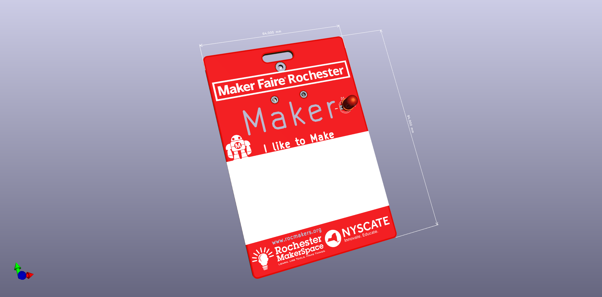
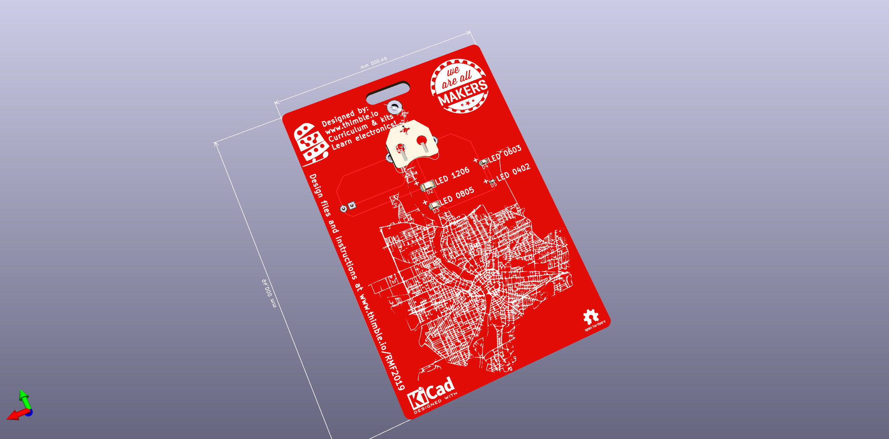

# Rochester Maker Faire 2019 Solder Badge

This repository contains the KiCAD design files and Gerbers for the 2019 Rochester Maker Faire Badge

This badge was designed by David Brenner of [Thimble.io](http://www.thimble.io) with support provided by [Rochester MakerSpace](https://rocmakers.org/).and [NYSCATE](http://www.nyscate.org/).

